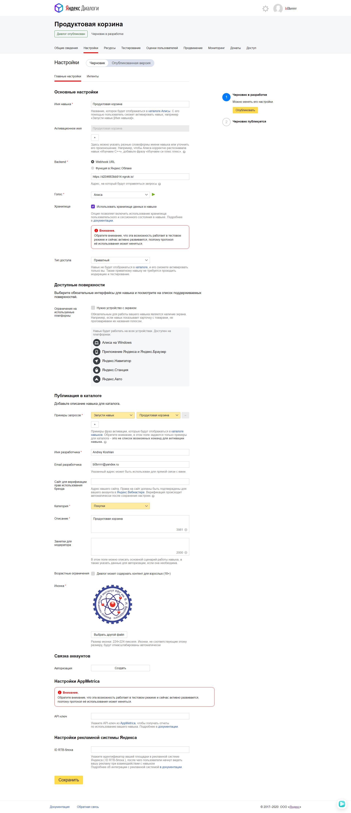
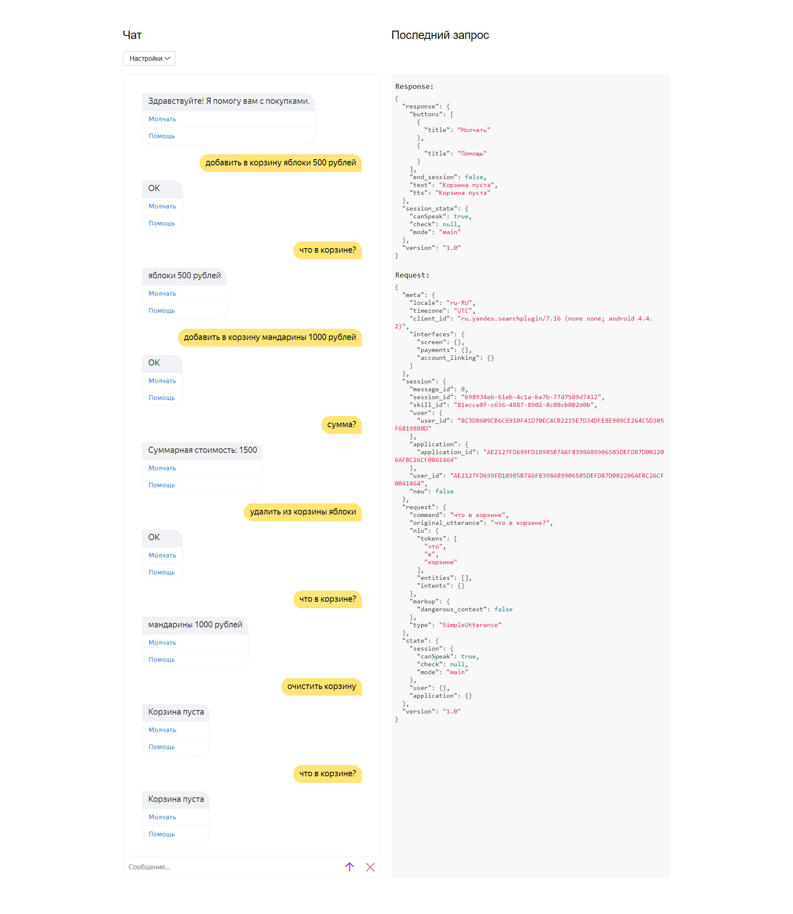
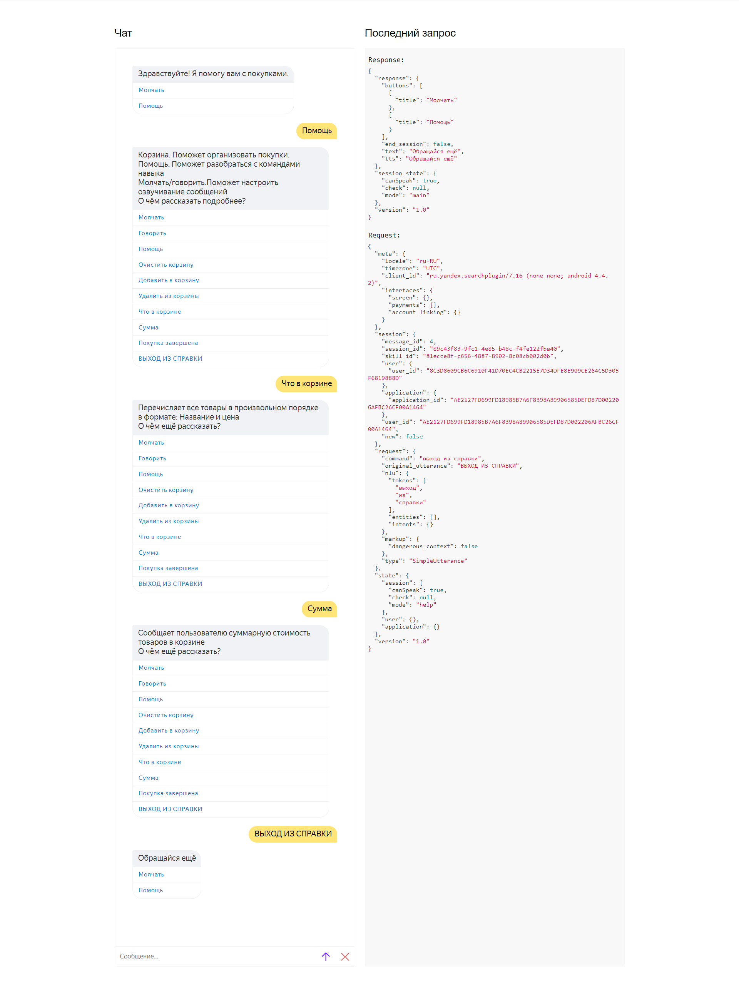

<p align="center">МИНИСТЕРСТВО НАУКИ  И ВЫСШЕГО ОБРАЗОВАНИЯ РОССИЙСКОЙ ФЕДЕРАЦИИ<br>
Федеральное государственное автономное образовательное учреждение высшего образования<br>
"КРЫМСКИЙ ФЕДЕРАЛЬНЫЙ УНИВЕРСИТЕТ им. В. И. ВЕРНАДСКОГО"<br>
ФИЗИКО-ТЕХНИЧЕСКИЙ ИНСТИТУТ<br>
Кафедра компьютерной инженерии и моделирования</p>
<br>
<h3 align="center">Отчёт по лабораторной работе № 2<br> по дисциплине "Программирование"</h3>
<br><br>
<p>студента 1 курса группы ПИ-б-о-201(2)<br>
Кошлань Андрей Юрьевич<br>
направления подготовки 09.03.04 "Программная инженерия"</p>
<br><br>
<table>
<tr><td>Научный руководитель<br> старший преподаватель кафедры<br> компьютерной инженерии и моделирования</td>
<td>(оценка)</td>
<td>Чабанов В.В.</td>
</tr>
</table>
<br><br>
<p align="center">Симферополь, 2020</p>
<hr>

# Лабораторная работа №2 Алиса
**Постановка задачи:**
1.  Разработать и зарегистрировать навык для Алисы на сервисе Яндекс.Диалоги;
2.  В качестве backend-a для навыка реализовать приложение на языке С++ выполняющее следующие функции:
    1.  Составление продуктовой корзины:
        -   Добавление продукта в корзину;
        -   Удаление продукта из корзины;
        -   Очистка корзины;
        -   Вывод списка товаров в корзине;
        -   Подсчёт стоимости товаров в корзине.
    2.  Вывод справочной информации по навыку;
    3.  Регистрацию webhook-ов сторонних сервисов;
    4.  Отправку данных на сторонние сервисы.
3.  В качестве стороннего сервиса реализовать приложение на языке Python выполняющее следующие функции:
    1.  Ожидание данных о покупке;
    2.  Сохранение поступивших данных в excel-документ.

**Цель работы:** 
1.  Получить представления о структуре post-запроса;
2.  Изучить webhooks как метод взаимодействия web-приложений;

## Ход работы

### 1. Настройка
На главной странице нажал кнопку Консоль, после чего попал на страницу dashboard со всеми созданными навыками. Затем нажал кнопку "Создать диалог", а далее "Навык в Алисе" и попал на страницу настройки навыка; Далее заполнил поля формы (рис. 1) в соответствии с документацией и опубликовал настройки диалога.


Рис. 1. Страница настроек навыка
### 2. Корзина
Корзина использует сессионные данные для хранения выбранных пользователем названий и цен товаров. Функция "Очистить корзину" очищает поле "check" в данных сессии, команда "Добавить в корзину" добавляет в корзину название и его цену, "Удалить из корзины" -  убирает из корзины указанный объект, "Что в корзине" - выводит все товары в формате: Название и цена, "Сумма" - сообщает суммарную стоимость всех товаров пользователю (рис. 2).


Рис. 2. Демонстрация функционала функции "Корзина"
### 3. Помощь
Если пользователь нажал кнопку "помощь", то режим навыка переключается в режим помощи, а затем перечисляются всевозможные навыки и их краткое описание. Для того чтобы отобразить детальную справку по команде, необходимо ввести необходимую команду или нажать на соответствующую ей кнопку (рис. 3).


Рис. 3. Демонстрация функционала функции "Помощь"
### 4. Управление списком WebHook-служб
При подключении к "/webhooks" на сервере, программа автоматически изменяет локальный файл "template.html" и редактирует соответствующие поля с блоками URL-адресов, подставляя в каждый из них информацию из файла "block.html", а затем возвращает браузеру html-документ (рис. 4). При добавлении или удалении соответствующего WebHook-а, браузер посылает POST-запрос на тот же URN серверу. Затем серверное приложение обрабатывает запрос и совершает необходимое действие.


Рис. 4. Страница управления webhook-ами
### 5. Заполнение Excel-файла
Для работы с Excel-документом клиентское приложение использует модуль Openpyxl для Python. Клиент получает с помощью модуля Flask json-строку с сервера C++. Затем происходит запись данных в буфер, также записывается дата отправки запроса. Буфер очищается, когда количество записей достигнет тысячи, а затем записывается в Excel документ.
Ссылка на Excel документ: [./excel/data.xlsx](./excel/data.xlsx)
### 6. Клиентское приложение
Для создания клиентского приложения использовался язык Python, весь исходный код хранится в одном файле. Использовались библиотеки Openpyxl и Flask. Приложение ждет запроса сервера и получает от него данные корзины пользователя. Исходный код приложения:
```py
from flask import Flask, request, jsonify
from datetime import datetime
import openpyxl
from openpyxl.styles import Alignment, PatternFill, Font, Border, Side

BUFFER_SIZE = 1
buf = []

def makeTable(sheet):
	sheet.column_dimensions['A'].width = 8
	sheet.column_dimensions['B'].width = 70
	sheet.column_dimensions['C'].width = 27
	sheet.column_dimensions['D'].width = 32
	sheet.column_dimensions['E'].width = 12
	sheet['A1'] = "N"
	sheet['B1'] = "User ID"
	sheet['C1'] = "Datetime"
	sheet['D1'] = "Item"
	sheet['E1'] = "Prise"
	for i in range(5):
		sheet[1][i].fill = PatternFill(start_color='F0F8F8F8',
                   end_color='F0F8F8F8',
                   fill_type='solid')
		sheet[1][i].alignment = Alignment(horizontal='center', vertical='center')
		sheet[1][i].font = Font(bold=True)
	return sheet

def getIdEmptyCell(sheet):
	i = 2
	bstyle = Border(left=Side(style='thin'), 
                     right=Side(style='thin'), 
                     top=Side(style='thin'), 
                     bottom=Side(style='thin'))
	#while not (sheet[i][3].value is None):
	while sheet[i][3].border == bstyle:
		i += 1
	return i

#borders and Aligment
def setMainStyle(sheet, y, x):
	bstyle = Border(left=Side(style='thin'), 
                     right=Side(style='thin'), 
                     top=Side(style='thin'), 
                     bottom=Side(style='thin'))
	for iy in range (1, y):
		for ix in range (0, x):
			sheet[iy][ix].border = bstyle
			sheet[iy][ix].alignment = Alignment(horizontal='center', vertical='center')
	return sheet

def getPrevID(sheet, y):
	i = y-1
	while (i > 1) and (sheet[i][0].value is None):
		i -= 1
	if i <= 1:
		return 1
	else:
		return sheet[i][0].value+1

def saveJson(sheet):
	y = getIdEmptyCell(sheet)
	for i in range(len(buf)):
		sheet[y][0].value = 1 if y <= 1 else getPrevID(sheet, y) 
		sheet[y][1].value = buf[i]["user_id"]
		sheet[y][2].value = buf[i]["datetime"]
		oldy = y
		try:
			for item in buf[i]["check"]:
				sheet[y][3].value = item["item"]
				sheet[y][4].value = item["price"]
				y += 1
		except:
			y += 1
		sheet.merge_cells(start_row=oldy, start_column=1, end_row=y-1, end_column=1)
		sheet.merge_cells(start_row=oldy, start_column=2, end_row=y-1, end_column=2)
		sheet.merge_cells(start_row=oldy, start_column=3, end_row=y-1, end_column=3)
	sheet = setMainStyle(sheet, y, 5)
	return sheet

def saveBuffer():
	global buf
	try:
		book = openpyxl.open("data.xlsx", read_only=False)
	except:
		book = openpyxl.Workbook()
	sheet = book.active
	if sheet['A1'].value is None:
		sheet = makeTable(sheet)
	sheet = saveJson(sheet)
	book.save("data.xlsx")


def writeData(content):
	global buf
	buf.append(content);
	buf[-1]["datetime"] = datetime.now().strftime("%d/%m/%Y %H:%M:%S")
	if len(buf) >= BUFFER_SIZE:
		saveBuffer()
		buf = []


app = Flask(__name__)
 
@app.route('/', methods=['POST', 'GET'])
def index():
	if request.is_json:
		content = request.get_json()
		writeData(content)
		return 'OK'
 
if __name__ == "__main__":
	app.run()
```
### 7. Серверное приложение
Для запуска сервера, был использован язык C++, а также сторонние библиотеки: httplib (для работы с HTTP-клиентом и HTTP-сервером), JSON for Modern C++ (позволяет работать с JSON-файлами). Если приходит запрос на "/webhooks", сервер формирует и отправляет html-страницу со список webhook-ов, если же запрос приходит на "/", сервер формирует и отправляет json-файл с ответными данными на Яндекс.Диалоги. Исходный код приложения:

**C++.cpp**
```c++
#include <iostream>
#include <vector>
#include <iomanip>
#include <cpp_httplib/httplib.h>
#include <nlohmann/json.hpp>
#include "WebHook.h"
#include "Dialogs.h"

using namespace httplib;
using std::string;
using json = nlohmann::json;

TAlice Alice;

string replace_str(string str, string source, string nw) {
	SIZE_T sbegin = str.find(source);
	return str.replace(sbegin, source.length(), nw);
}

string readFile(string filename) {
	std::ifstream is(filename);
	std::stringstream ss;
	ss << is.rdbuf();
	return ss.str();
}

void process_post(const Request& req, Response& res) {
	if (req.method != "POST")
		return;

	if (req.has_param("del")) {
		string val = req.get_param_value("del");
		int id = wh.Search(val);
		if (id >= 0)
			wh.Erase(id);
	}
	if  (req.has_param("set")) {
		string val = req.get_param_value("set");
		wh.PushBack(val);
	}
	res.set_redirect("#");
}

void wh_response(const Request& req, Response& res) {
	string block_original = readFile("block.html");
	string blocks = "";
	for (int i = 0; i < wh.Size(); i++) {
		string block_temp = block_original;
		block_temp = replace_str(block_temp, "Webhook URL", wh.Get(i));
		block_temp = replace_str(block_temp, "Webhook URL", wh.Get(i));
		blocks += block_temp+"\n";
	}
	string templ = readFile("template.html");
	templ = replace_str(templ, "{webhooks_list}", blocks);
	process_post(req, res);
	res.set_content(templ, "text/html");
}

void dialog_response(const Request& req, Response& res) {
	string body = req.body.c_str();
	string aresp = Alice.GetResponse(body);
	res.set_content(aresp, "text/plain");
}

int main()
{
	Server svr;   
	svr.Post("/", dialog_response);
	svr.Get("/webhooks", wh_response);
	svr.Post("/webhooks", wh_response);
	std::cout << "Start server... OK\n";
	svr.listen("127.0.0.1", 1234);
}
```
**Dialogs.h**
```c++
#pragma once

#include "WebHook.h"

using namespace httplib;
using std::string;
using json = nlohmann::json;

class TAlice {
public:
	string GetWordFromTokens(json tokens, unsigned int id);
	string GetWordsFromTokens(json tokens, unsigned int beginid, unsigned int endid);
	string GetResponse(string body);
	string GetResponseMain(string body, json j, json tokens, json state);
	string GetResponseHelp(string body, json j, json tokens, json state, bool start = false);
	json CreateButtonsMain(json state);
	json CreateButtonsHelp(json state);
	void EraseFromCart(json &state, string name);
	string GetCart(json state);
	string GetCartSum(json state);
	string CreateResponse(string s, json state, json buttons, bool end_session = false);
	TAlice();
};

string TAlice::CreateResponse(string s, json state, json buttons, bool end_session) {
	json j;
	j["response"]["text"] = s;
	if (state["canSpeak"])
		j["response"]["tts"] = s;
	j["response"]["buttons"] = buttons;
	j["response"]["end_session"] = end_session;
	j["version"] = "1.0";
	j["session_state"] = state;
	std::stringstream ss;
	ss << std::setw(2) << j << std::endl;
	return ss.str();
}

string TAlice::GetWordFromTokens(json tokens, unsigned int id) {
	if (id < tokens.size()) {
		string s = tokens[id];
		return s;
	}
	return "";
}

string TAlice::GetWordsFromTokens(json tokens, unsigned int beginid, unsigned int endid) {
	string rez = "";
	for (int i = beginid; i <= endid; i++) {
		rez += GetWordFromTokens(tokens, i);
		if (i != endid) rez += " ";
	}
	return rez;
}

json TAlice::CreateButtonsMain(json state) {
	json buttons = json::array();
	if (state["canSpeak"]) {
		buttons[0]["title"] = u8"Молчать";
	} else {
		buttons[0]["title"] = u8"Говорить";
	}
	buttons[1]["title"] = u8"Помощь";
	return buttons;
}

json TAlice::CreateButtonsHelp(json state) {
	json buttons = json::array();
	buttons[0]["title"] = u8"Молчать";
	buttons[1]["title"] = u8"Говорить";
	buttons[2]["title"] = u8"Помощь";
	buttons[3]["title"] = u8"Очистить корзину";
	buttons[4]["title"] = u8"Добавить в корзину";
	buttons[5]["title"] = u8"Удалить из корзины";
	buttons[6]["title"] = u8"Что в корзине";
	buttons[7]["title"] = u8"Сумма";
	buttons[8]["title"] = u8"Покупка завершена";
	buttons[9]["title"] = u8"ВЫХОД ИЗ СПРАВКИ";
	return buttons;
}

void TAlice::EraseFromCart(json &state, string name) {
	for (int i = 0; i < state["check"].size(); i++) {
		if (state["check"][i]["item"] == name) {
			state["check"].erase(i);
			return;
		}
	}
}

string TAlice::GetCart(json state) {
	if (state["check"].size() <= 0) {
		return u8"Корзина пуста";
	}
	string rez = "";
	for (int i = 0; i < state["check"].size(); i++) {
		string name = state["check"][i]["item"];
		int price = state["check"][i]["price"];
		string temp;
		temp = name + u8" " + std::to_string(price);
		temp = temp + u8" рублей\n";
		rez += temp;
	}
	rez.pop_back(); //remove last return
	return rez;
}

string TAlice::GetCartSum(json state) {
	int total = 0;
	for (int i = 0; i < state["check"].size(); i++) {
		total += state["check"][i]["price"];
	}
	return u8"Суммарная стоимость: " + std::to_string(total);
}

string TAlice::GetResponseMain(string body, json j, json tokens, json state) {
	if (j["session"]["new"]) {
		state["canSpeak"] = true;
		state["check"] = {};
		state["mode"] = "main";
	}

	string rez = "";
	json buttons = CreateButtonsMain(state);

	if (j["session"]["new"]) {
		rez = u8"Здравствуйте! Я помогу вам с покупками.";
		return CreateResponse(rez, state, buttons);
	}
	if (GetWordFromTokens(tokens, 0) == u8"молчать") {
		state["canSpeak"] = false;
		json buttons = CreateButtonsMain(state);
		rez = u8"Молчу, молчу";
		return CreateResponse(rez, state, buttons);
	}
	if (GetWordFromTokens(tokens, 0) == u8"говорить") {
		state["canSpeak"] = true;
		json buttons = CreateButtonsMain(state);
		rez = u8"Хорошо";
		return CreateResponse(rez, state, buttons);
	}
	if (GetWordFromTokens(tokens, 0) == u8"помощь") {
		state["mode"] = u8"help";
		return GetResponseHelp(body, j, tokens, state, true);
	}
	if (GetWordsFromTokens(tokens, 0, 1) == u8"очистить корзину")  {
		state["check"] = {};
		rez = u8"Корзина пуста";
		return CreateResponse(rez, state, buttons);
	}
	if (GetWordsFromTokens(tokens, 0, 2) == u8"добавить в корзину") {
		string name = GetWordFromTokens(tokens, 3);
		int price = std::stoi(GetWordFromTokens(tokens, 4));
		state["check"].push_back({ {"item", name}, {"price", price} });
		rez = u8"ОК";
		return CreateResponse(rez, state, buttons);
	}
	if (GetWordsFromTokens(tokens, 0, 2) == u8"удалить из корзины") {
		string name = GetWordFromTokens(tokens, 3);
		EraseFromCart(state, name);
		rez = u8"ОК";
		return CreateResponse(rez, state, buttons);
	}
	if (GetWordsFromTokens(tokens, 0, 2) == u8"что в корзине") {
		rez = GetCart(state);
		return CreateResponse(rez, state, buttons);
	}
	if (GetWordFromTokens(tokens, 0) == u8"сумма") {
		rez = GetCartSum(state);
		return CreateResponse(rez, state, buttons);
	}
	if (GetWordsFromTokens(tokens, 0, 1) == u8"покупка завершена") {
		wh.SendToAll(state["check"], j["session"]["user"]["user_id"]);
		return CreateResponse(u8"Заходите еще", state, buttons, true);
	}
	if (/* COMMAND UNKNOWN */1) {
		rez = u8"Неизвестная команда";
		return CreateResponse(rez, state, buttons);
	}
}

string TAlice::GetResponseHelp(string body, json j, json tokens, json state, bool start) {
	string rez;
	json buttons = CreateButtonsHelp(state);
	if (start) {
		rez = u8"Корзина. Поможет организовать покупки.\nПомощь. Поможет разобраться с командами навыка\nМолчать/говорить.\
Поможет настроить озвучивание сообщений\nО чём рассказать подробнее?";
		return CreateResponse(rez, state, buttons);
	}
	if (GetWordFromTokens(tokens, 0) == u8"молчать") {
		rez = u8"Все последующие сообщения после выполнения команды в пределах сессии выводятся без озвучивания";
		rez += u8"\nО чём ещё рассказать?";
		return CreateResponse(rez, state, buttons);
	}
	if (GetWordFromTokens(tokens, 0) == u8"говорить") {
		rez = u8"Все последующие сообщения после выполнения команды в пределах сессии озвучиваются";
		rez += u8"\nО чём ещё рассказать?";
		return CreateResponse(rez, state, buttons);
	}
	if (GetWordFromTokens(tokens, 0) == u8"помощь") {
		rez = u8"Режим работы навыка переключается в режим помощи";
		rez += u8"\nО чём ещё рассказать?";
		return CreateResponse(rez, state, buttons);
	}
	if (GetWordsFromTokens(tokens, 0, 1) == u8"очистить корзину")
	{
		rez = u8"ОЧИСТИТЬ КОРЗИНУ [название]\nПолная очистка корзины. После выполнения команды все элементы корзины будут безвозвратно удалены";
		rez += u8"\nО чём ещё рассказать?";
		return CreateResponse(rez, state, buttons);
	}
	if (GetWordsFromTokens(tokens, 0, 2) == u8"добавить в корзину") {
		rez = u8"ДОБАВИТЬ В КОРЗИНУ [название, цена]\nВ корзину добавляется новый товар, указывается его цена и наименование. Цена товара - это целые рубли";
		rez += u8"\nО чём ещё рассказать?";
		return CreateResponse(rez, state, buttons);
	}
	if (GetWordsFromTokens(tokens, 0, 2) == u8"удалить из корзины") {
		rez = u8"УДАЛИТЬ ИЗ КОРЗИНЫ [название]\nБезвозвратно удаляет товар из корзины по названию товара";
		rez += u8"\nО чём ещё рассказать?";
		return CreateResponse(rez, state, buttons);
	}
	if (GetWordsFromTokens(tokens, 0, 2) == u8"что в корзине") {
		rez = u8"Перечисляет все товары в произвольном порядке в формате: Название и цена";
		rez += u8"\nО чём ещё рассказать?";
		return CreateResponse(rez, state, buttons);
	}
	if (GetWordFromTokens(tokens, 0) == u8"сумма") {
		rez = u8"Сообщает пользователю суммарную стоимость товаров в корзине";
		rez += u8"\nО чём ещё рассказать?";
		return CreateResponse(rez, state, buttons);
	}
	if (GetWordsFromTokens(tokens, 0, 1) == u8"покупка завершена") {
		rez = u8"Завершает оформление покупок и закрывает пользовательскую сессию";
		rez += u8"\nО чём ещё рассказать?";
		return CreateResponse(rez, state, buttons);
	}
	if (GetWordsFromTokens(tokens, 0, 2) == u8"выход из справки") {
		state["mode"] = u8"main";
		rez = u8"Обращайся ещё";
		return CreateResponse(rez, state, CreateButtonsMain(state));
	}
	if (/* COMMAND UNKNOWN */1) {
		rez = u8"Неизвестная команда";
		return CreateResponse(rez, state, buttons);
	}
}

string TAlice::GetResponse(string body) {
	json j = json::parse(body);
	json tokens = j["request"]["nlu"]["tokens"];
	json state = j["state"]["session"];
	string mode;

	try {
		mode = state["mode"];
	} catch (...) {
		mode = u8"main";
	}
	
	/* Main response */
	if (mode == u8"main") {
		return GetResponseMain(body, j, tokens, state);
	}
	if (mode == u8"help") {
		return GetResponseHelp(body, j, tokens, state);
	}

	string rez = "Недействительная сессия";
	return CreateResponse(rez, state, "{}");
}

TAlice::TAlice() {
	//DO NOTHING
}
```
**WebHook.h**
```c++
#pragma once

using namespace httplib;
using std::string;
using json = nlohmann::json;

typedef std::vector<string> webhdata;

class WebHook {
public:
	void SendToAll(json state, string user_id);
	int Size();
	int Search(string val);
	string GetJSON();
	void Erase(unsigned int id);
	string Get(unsigned int id);
	void PushBack(string val);
	void SaveToFile();
	bool LoadFromFile();
	webhdata data;
	WebHook();
private:
	const string filename = "webhooks.json";
	const string field = "WebHooks";
};

WebHook wh;

void WebHook::SendToAll(json state, string user_id) {
	json fulljson;
	fulljson["user_id"] = user_id;
	fulljson["check"] = state;
	for (int i = 0; i < this->data.size(); i++) {
		string url = this->data.at(i);
		Client cli(url.c_str());
		std::cout << "Post data: " << fulljson << "\n";
		std::cout << "Sending state to " + url + "...";
		std::stringstream ss;
		ss << fulljson;
		//string strstate = "({\"json\": \"" + ss.str() + "\"})";
		auto res = cli.Post("/", ss.str(), "application/json");
		if (res) {
			if (res->status == 200) {
				std::cout << " [OK]\n";
			} else {
				std::cout << " [FAIL]\nStatus code: " << res->status << std::endl;
			}
		} else {
			std::cout << "[FAIL]\nError code: " << res.error() << std::endl;
		}
	}
}

int WebHook::Size() {
	return this->data.size();
}

int WebHook::Search(string val) {
	for (int i = 0; i < this->data.size(); i++) {
		if (this->data.at(i) == val) {
			return i;
		}
	}
	return -1;
}

string WebHook::GetJSON() {
	json j;
	j["WebHooks"] = json::array();
	for (int i = 0; i < this->data.size(); i++) {
		j["WebHooks"].push_back(this->data[i]);
	}
	std::stringstream ss;
	ss << std::setw(2) << j;
	return ss.str();
}

void WebHook::Erase(unsigned int id) {
	this->data.erase(this->data.begin() + id);
	this->SaveToFile();
}

string WebHook::Get(unsigned int id) {
	return this->data.at(id);
}

void WebHook::PushBack(string val) {
	this->data.push_back(val);
	this->SaveToFile();
}

void WebHook::SaveToFile() {
	std::ofstream os(this->filename);
	os << this->GetJSON() << std::endl;
	os.close();
}

bool WebHook::LoadFromFile() {
	std::ifstream is(this->filename);
	if (is) {
		json j = json::parse(is);
		for (int i = 0; i < j["WebHooks"].size(); i++) {
			this->data.push_back(j["WebHooks"][i]);
		}
		return true;
	}
	else {
		return false;
	}
	is.close();
}

WebHook::WebHook() {
	if (!this->LoadFromFile()) {
		this->SaveToFile();
	}
}
```