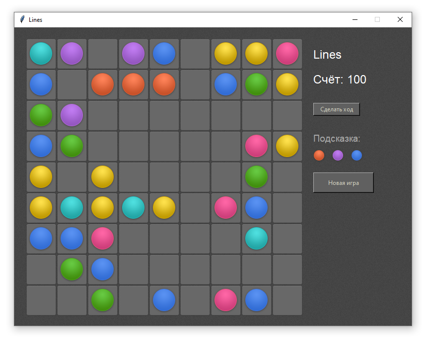
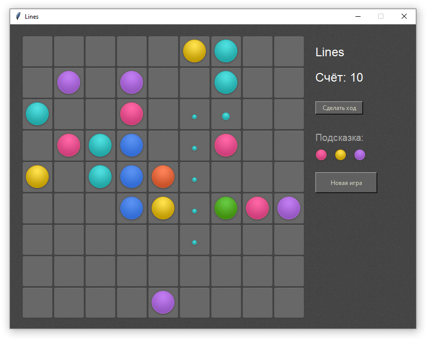

  
<p align="center">МИНИСТЕРСТВО НАУКИ  И ВЫСШЕГО ОБРАЗОВАНИЯ РОССИЙСКОЙ ФЕДЕРАЦИИ<br>
Федеральное государственное автономное образовательное учреждение высшего образования<br>
"КРЫМСКИЙ ФЕДЕРАЛЬНЫЙ УНИВЕРСИТЕТ им. В. И. ВЕРНАДСКОГО"<br>
ФИЗИКО-ТЕХНИЧЕСКИЙ ИНСТИТУТ<br>
Кафедра компьютерной инженерии и моделирования</p>
<br>
<h3 align="center">Отчёт по лабораторной работе № 3<br> по дисциплине "Программирование"</h3>
<br><br>
<p>студента 1 курса группы ПИ-б-о-201(2)<br>
Кошлань Андрей Юрьевич<br>
направления подготовки 09.03.04 "Программная инженерия"</p>
<br><br>
<table>
<tr><td>Научный руководитель<br> старший преподаватель кафедры<br> компьютерной инженерии и моделирования</td>
<td>(оценка)</td>
<td>Чабанов В.В.</td>
</tr>
</table>
<br><br>
<p align="center">Симферополь, 2020</p>
<hr>

# Лабораторная работа №3 Игра "Lines"
**Постановка задачи:**
1.  Используя стандартный модуль для разработки программ с графическим интерфейсом Tkinter реализовать игру Lines на языке Python.
2.  В качестве образца графического интерфейса использовать  [данную игру](http://game-shariki.ru/linii-2).

**Цель работы:** 
1.  Закрепить навыки разработки программ с простым графическим интерфейсом пользователя на языке Python при помощи библиотеки Tkinter;
2.  Получить представление о разработке простых игровых приложений.

## Ход работы

### 1. Разработка ПО
Для создания клиентского приложения использовался язык Python, исходный код разделен на несколько модулей. Приложение использует различные библиотеки для работы с графикой, такие как `Tkinter` и `Pillow`. Для запуска игры необходимо открыть файл `start.py`. Ссылка на исходный код: [./Python/](./Python/).
### 2. Графический интерфейс
Для работы с графическими возможностями Python использовались две библиотеки: `Tkinter` и `Pillow`, первое из которых позволяет создавать различные компоненты графического интерфейса пользователя. В приложении это пригодилось для создания различных кнопок и надписей. В то время как `Pillow` обладает функционалом для работы с растровыми изображениями. Благодаря данной библиотеки приложение отображает различные игровые элементы: шарики, анимации и фон игрового окна (рис. 1).



Рис. 1. Интерфейс приложения в процессе игры

Для работы с изображениями был написан вспомогательный модуль `imgutils`, который позволяет с помощью библиотеки `Pillow` открывать, трансформировать и совмещать изображения игры. 

```py
from tkinter import *
from PIL import Image, ImageTk

def image_load(filename, cropx1 = 0, cropy1 = 0, cropx2 = 0, cropy2 = 0, w = 0, h = 0):
	x = Image.open("data\\"+filename).convert("RGBA")
	if cropx2+cropy2 > 0:
		x = x.crop((cropx1, cropy1, cropx2, cropy2))
	if w+h > 0:
		x = x.resize((w, h), Image.ANTIALIAS)
	return x

def image_render(obj, img):
	obj.img = img;
	obj.image = ImageTk.PhotoImage(img)
	obj.configure(image=obj.image)

def label_render(obj, img): #Canvas Only
	obj.update()
	obj.img = Image.new("RGBA", (obj.winfo_reqwidth(), obj.winfo_reqheight()));
	obj.img = image_compasite(obj.img, img, -obj.winfo_x(), -obj.winfo_y())
	obj.image = ImageTk.PhotoImage(obj.img)
	obj.create_image(0, 0, image=obj.image, anchor=NW)
	obj.create_text(0, 0, text=obj.text, font=obj.font, anchor="nw",
                          fill=obj.fontcolor)

def canvas_render(obj, img, img_background):
	obj.update() 
	obj.img = image_compasite(img, img_background, 0, 0)
	obj.img = image_compasite(obj.img, img, 0, 0)
	obj.image = ImageTk.PhotoImage(obj.img)
	obj.create_image(0, 0, image=obj.image, anchor=NW)

def image_compasite(bottom_img, top_img, x, y):
	top_upscale_img = Image.new("RGBA", bottom_img.size)
	top_upscale_img.paste(top_img, (x, y))
	return Image.alpha_composite(bottom_img, top_upscale_img)
``` 
### 3. Анимации
Приложение использует анимации перемещения, затухания и появления шариков на игровом поле (рис. 2). Для этого используется вышеописанный модуль `imgutils`. 



Рис. 2. Анимация перемещения шарика

Все анимации прописаны в модуле `ui`. Для запуска анимации необходимо вызвать функцию `start_animation` с параметрами класса `Tk` модуля `Tkinter`, типом анимации и списком ячеек для которых анимация будет применена.
```py
def start_animation(root, animtype, listcell):
	t = threading.Thread(target=animation_proc, args=(root, animtype, listcell,))
	t.daemon = True
	t.start()
```
После вызова функции приложение создаст отдельный поток и вызовет функцию `animation_proc` в котором будет воспроизводится указанная анимация.
```py
def animation_proc(root, animtype, listcell):
	if animtype == "blowup":
		for i in range(6, -1, -1):
			for cell in listcell:
				draw_cell(root, [cell], cell.selected, cell.ball, i, False, True);
			time.sleep(1/ANIM_SPEED)
	if animtype == "tail":
		ball_name = listcell[0].animball
		start_animation(root, "fadeout", [listcell[0]])
		stack = []
		for cell in listcell:
			if (cell == listcell[0]):
				continue
			if len(stack)+1 > ANIM_TAIL_COUNT:
				draw_cell(root, [stack[-1]], stack[-1].selected, "none", 0, False, True);
				stack.pop(-1)
			stack.insert(0, cell)
			if (cell == listcell[-1]):
				draw_cell(root, [stack[0]], stack[0].selected, ball_name, 0, True, True);
			else:
				draw_cell(root, [stack[0]], stack[0].selected, ball_name, 6, False, True);
			time.sleep(1/ANIM_SPEED)
		for cell_id in range(len(stack)-1, 0, -1):
			cell = stack[cell_id]
			draw_cell(root, [cell], cell.selected, "none", 0, False, True);
			time.sleep(1/ANIM_SPEED)
	if animtype == "fadeout":
		for i in range(6):
			for cell in listcell:
				draw_cell(root, [cell], cell.selected, cell.animball, i, False, True);
			time.sleep(1/ANIM_SPEED)
		for cell in listcell:
			draw_cell(root, [cell], cell.selected, "none", 0, False, True);
```

### 4. Алгоритм поиска кратчайшего пути
Чтобы найти кратчайший путь, приложение использует метод поиска пути в ширину. Алгоритм обходит все свободные ячейки поочередно, делая от каждой пройденной ячейки в очереди один шаг. Это позволяет легко найти кратчайшее расстояние до необходимой ячейки. Данный алгоритм поиска описан в модуле `game`.
```py
def is_cell_free(qmap, x, y):
		return		(x >= 0) and (y >= 0)\
			and (x < len(qmap)) and (y < len(qmap[0]))\
			and (qmap[x][y] == "none")

def get_back_path(root, graph, idx):
	i = idx
	cell = []
	while (idx >= 0):
		x = graph[idx][0]
		y = graph[idx][1]
		cell.insert(0, root.cell[x][y])
		idx = graph[idx][2]
	return cell

def search_path(root, cell_start, cell_end):
	destx = cell_end.x
	desty = cell_end.y
	map_size = len(root.cell)
	qmap = [map_size*[None] for x in range(map_size)]
	for i in range(map_size):
		for j in range(map_size):
			qmap[i][j] = root.cell[i][j].ball
	graph = [[cell_start.x, cell_start.y, -1]]
	i = 0
	while i < len(graph):
		x = graph[i][0]
		y = graph[i][1]
		qmap[x][y] = "searched"

		if (x == cell_end.x) and (y == cell_end.y):
			return get_back_path(root, graph, i)
			break;

		if is_cell_free(qmap, x+1, y):
			graph += [[x+1, y, i]]

		if is_cell_free(qmap, x, y+1):
			graph += [[x, y+1, i]]

		if is_cell_free(qmap, x-1, y):
			graph += [[x-1, y, i]]

		if is_cell_free(qmap, x, y-1):
			graph += [[x, y-1, i]]

		i += 1
	return None
```
### 5. Алгоритм поиска свободной ячейки
После каждого хода игровое приложение создает 3 новых шарика, при этом усложняя игровой процесс для пользователя. Прежде чем их создать, приложение ищет 3 случайные свободные ячейки. Для этого программа проверяет каждую ячейку поочередно и, если она свободна, записывает в отдельный список. Далее при помощи модуля Python `random` приложение случайно выбирает на выбор необходимое количество свободных ячеек. Весь алгоритм данного метода описан в модуле `game`.
```py
def get_random_free_cell(root):
	free_cells = []
	for lst in root.cell:
		for x in lst:
			if x.ball == "none":
				free_cells += [x]
	if len(free_cells) == 0:
		return None
	else:
		return random.choice(free_cells)
```
### 6. Алгоритм нахождения линии из пяти шариков
После каждого хода игрока, приложение находит шарики, выстроенные в ряд, и удаляет их. Для этого приложение рассматривает указанную ячейку и в зависимости от метода проверки (по вертикали, по горизонтали, по диагонали) возвращается в крайнюю ячейку и начинает проверку ряда. Если в ряду обнаруживается 5 одинаковых, друг за другом последующих, шарика, то приложение запускает новый поток с анимацией затухания и удаляет их.
## Вывод
Закрепил навыки разработки программ с простым графическим интерфейсом пользователя на языке Python при помощи библиотеки Tkinter, получил представление о разработке простых игровых приложений.